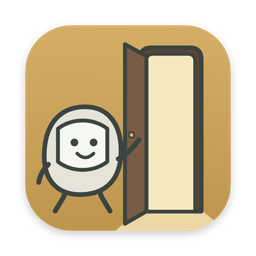
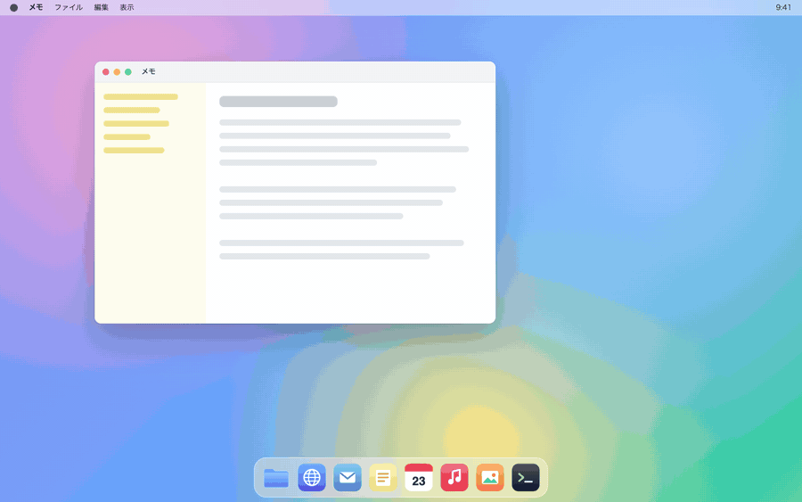

# OpenSesame!



キーを押している間だけ出てくるランチャーです。macOS と Windows で使えます。

Control + Option（Windows は Ctrl + Alt）を押しっぱなしにするとキーボード型のパネルが出てきて、そのまま登録したキーを押せばアプリやフォルダが開きます。前面のウィンドウを左半分・右半分などに並べることもできます。



## 動作環境

- macOS 11 以降（Apple Silicon / Intel）
- Windows 10 / 11（64bit）

## ダウンロード

[Releases](../../releases/latest) から OS に合ったファイルをダウンロードしてください。

- macOS: `OpenSesame!_x.y.z_universal.dmg`
- Windows: `OpenSesame!_x.y.z_x64-setup.exe`

## インストール

### macOS

1. `.dmg` を開いて、OpenSesame! を Applications フォルダにドラッグします。
2. アプリケーションフォルダから OpenSesame! を起動します。

Apple の公証を受けていないので、初回は「開発元を確認できません」といった警告が出て開けません。いったん警告を閉じて、システム設定 → プライバシーとセキュリティ の下の方にある「このまま開く」を押してください。一度開けば、次からは普通に起動できます。

「壊れているため開けません」と出る場合は、ターミナルで次を実行してから開き直してください。

```bash
xattr -dr com.apple.quarantine "/Applications/OpenSesame!.app"
```

起動すると設定画面に「アクセシビリティの許可が必要です」と表示されます。ほかのアプリを使っている間もキー入力を受け取るために必要な許可です。

1. 「アクセシビリティ設定を開く」を押す
2. 一覧の下の「＋」から OpenSesame! を追加する
3. OpenSesame! のスイッチをオンにする

数秒で案内が消えれば準備完了です。再起動はいりません。

ウィンドウを並べる機能を初めて使ったときは「System Events を制御しようとしています」と聞かれるので、「許可」を押してください。

> アプリケーションフォルダ以外（ダウンロードフォルダなど）から起動すると、アクセシビリティの許可がうまく残らないことがあります。

### Windows

`-setup.exe` を実行してインストールします。「Windows によって PC が保護されました」と表示されたら、「詳細情報」→「実行」で進めてください（コード署名をしていないため表示されます）。

Windows では追加の設定は必要ありません。

## 使い方

### 登録する

設定画面の上にあるキーボードの図で空いているキーをクリックすると、「ウィンドウサイズ変更」「アプリの起動」「フォルダの選択」から割り当てを選べます。右上の「＋ アプリ」「＋ フォルダ」から追加すると、空いているキーが自動で割り当てられます。

登録したものは下の一覧で、表示名やキーを変えたり、アイコンを好きな PNG に差し替えたりできます。

### 呼び出す

- 起動キーを押したまま、登録したキーを押す → アプリ・フォルダを開く / ウィンドウを並べる
- 起動キー + `.` → 設定画面を開く
- 起動キーを離す → パネルが消える

設定画面を閉じてもアプリは裏で動き続けます。終了するときは、メニューバー（Windows はタスクバー右下）のアイコンから「OpenSesame! を終了」を選んでください。

### 起動キーを変える

設定画面の「起動キー」欄にカーソルを合わせて delete（Windows は Backspace）を押し、使いたい修飾キーを同時に押して離すと切り替わります。Control / Option（Alt）/ Command（Win）/ Shift から3つまで、左右も区別して選べます。Esc で取り消せます。

### ログイン時に起動する

- macOS: システム設定 → 一般 → ログイン項目 の「＋」から OpenSesame! を追加
- Windows: `Win + R` で `shell:startup` を開き、OpenSesame! のショートカットを置く

## うまく動かないとき

**パネルが出ない（macOS）**
アクセシビリティの許可を確認してください。アプリを更新した後に効かなくなった場合は、一覧から OpenSesame! を「－」で消して追加し直すと直ります。VoiceOver を使っている場合、初期設定の Control + Option とぶつかるので起動キーを変えてください。

**パネルが出ない（Windows）**
管理者権限で動いているアプリが前面にあると、Windows の仕様でキーを受け取れません。

**ウィンドウが並ばない（macOS）**
システム設定 → プライバシーとセキュリティ → オートメーション で、OpenSesame! の「System Events」がオンになっているか確認してください。

**「対象が見つかりません」と出て保存できない**
登録したアプリやフォルダが移動・削除されたか、外付けドライブが外れています。一覧から削除するか、ドライブをつなぎ直してください。

**設定が消えた**
設定ファイルが壊れていた場合は、元のファイルを `config.json.broken-<数字>` として残し、初期設定で起動します。

## アンインストール

アプリを終了してから、macOS はアプリケーションフォルダの OpenSesame! をゴミ箱へ、Windows は「設定 → アプリ」からアンインストールしてください。

設定も消したい場合は、次のフォルダを削除します。

- macOS: `~/Library/Application Support/io.github.kobito-tools.opensesame`
- Windows: `%LOCALAPPDATA%\io.github.kobito-tools.opensesame`

macOS では、アクセシビリティの一覧に残った OpenSesame! も「－」で消しておいてください。

## プライバシー

OpenSesame! はネットワークに接続しません。キー入力は起動キーと登録キーの判定にだけ使っていて、記録や送信はしていません。設定はお使いのパソコンの中にだけ保存されます。

## ライセンス

[MIT License](LICENSE) です。

このソフトウェアは無保証です。使用によって生じたいかなる損害についても、作者は責任を負いません。詳しくは LICENSE をご確認ください。

## その他

開発には ChatGPT（OpenAI）と Claude（Anthropic）を使っています。両社とは関係のない個人のプロジェクトです。

ビルド方法やコードの構成は [docs/DEVELOPMENT.md](docs/DEVELOPMENT.md) にまとめています。不具合や要望は [Issues](../../issues) へどうぞ。
